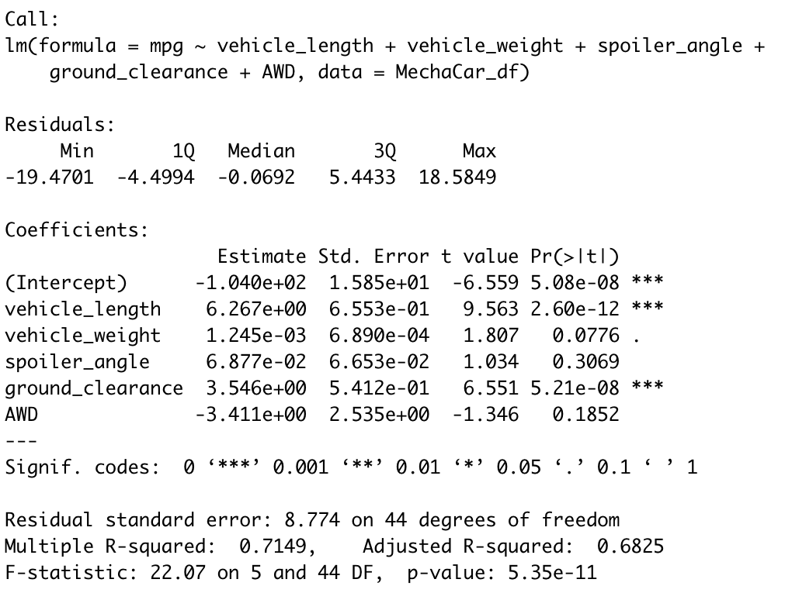

# MechaCar_Statistical_Analysis
Module 15

## Linear Regression to Predict MPG

<li> The variables/coefficients that provide a non-random amount of variance to the MPG value are: Vehicle Weight, Spoiler Angle, and AWD feature. </li>
<li> The p-value of the linear regression analysis is 5.35e-11 which is below the assumed significance level of 0.05%; the slope of the linear model is not considered to be zero. </li>
<li> The model does effectively predict the MPG as the r-squared value is .71 which means that 70% of the predictions will be correct using the linear model. </li>
 
 

