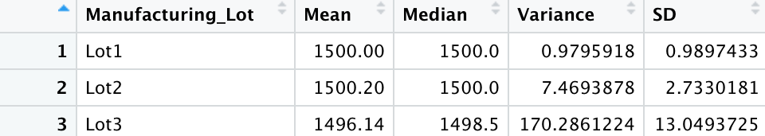

# MechaCar_Statistical_Analysis
Module 15

## Linear Regression to Predict MPG

<li> The variables/coefficients that provide a non-random amount of variance to the MPG value are: Vehicle Weight, Spoiler Angle, and AWD feature. </li>
<li> The p-value of the linear regression analysis is 5.35e-11 which is below the assumed significance level of 0.05%; the slope of the linear model is not considered to be zero. </li>
<li> The model does effectively predict the MPG as the r-squared value is .71 which means that 70% of the predictions will be correct using the linear model. </li>
 
 

## Summary Statistics on Suspension Coils
This summary was created to show the results from multiple production lots; the weight capacities of multiple suspension coils were tested to determine consistency throughout the three lots. The variance is reported at 62.29356 which falls within the 100 pounds per square inch. 
 
 

 
 
 
### Results by Lot
Though the summary shows a variance within the 100 pounds per square inch, Lot 3 is over with a variance of approximately 170.29.
 
 

 
